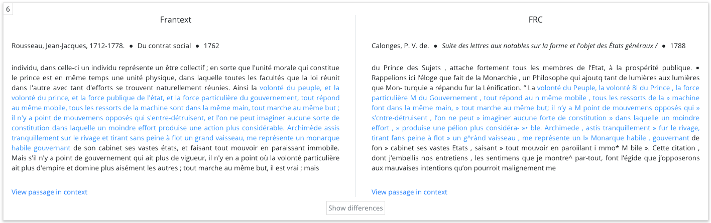

"Nous ne faisons que nous entregloser", Montaigne (<i>Essais</i>)

 Since all we do is glose over what's been written before us, we may as well build a tool to detect these gloses... 
 
# TextPAIR (Pairwise Alignment for Intertextual Relations)

TextPAIR is a scalable and high-performance sequence aligner for humanities text analysis designed to identify "similar passages" in large collections of texts. These may include direct quotations, plagiarism and other forms of borrowings, commonplace expressions and the like. It is a complete rewrite and rethink of the <a href="https://code.google.com/archive/p/text-pair/">original implementation</a> released in 2009.

While TextPAIR was developed in response to the fairly specific phenomenon of similar passages across literary works, the sequence analysis techniques employed in TextPAIR were developed in widely disparate fields, such as bioinformatics and computer science, with applications ranging from genome sequencing to plagiarism detection. TextPAIR generates a set of overlapping word sequence shingles for every text in a corpus, then stores and indexes that information to be analyzed against shingles from other texts. For example, the opening declaration from Rousseau's Du Contrat Social,

`"L'homme est né libre, est partout il est dans les fers. Tel se croit le maître des autres, qui ne laisse pas d'être plus esclave qu'eux,"`

would be rendered in trigram shingles (with lemmatization, accents flattened and function words removed) as:

`homme_libre_partout, libre_partout_fer, partout_fer_croire, fer_croire_maitre, croire_maitre_laisser, maitre_laisser_esclave`

Common shingles across texts indicate many different types of textual borrowings, from direct citations to more ambiguous and unattributed usages of a passage. Using a simple search form, the user can quickly identify similar passages shared between different texts in one database, or even across databases, such as in the example below.



## Installation

Note that TextPair will only run on 64 bit Linux and MacOS. Windows will NOT be supported.

#### Dependencies

-   Python 3.6 and up
-   Node and NPM
-   PostgreSQL: you will need to create a dedicated database and create a user with read/write permissions on that database. You will also need to create the pg_trgm extension on that database by running the following command in the PostgreSQL shell: `CREATE EXTENSION pg_trgm;` run as a superuser.
-   A running instance of Apache with mod_wsgi configured

#### Install script
See <a href="docs/ubuntu_installation.md">Ubuntu install instructions</a>

-   Run `install.sh` script. This should install all needed components
-   Make sure you include `/etc/text-pair/apache_wsgi.conf` in your main Apache configuration file to enable searching
-   Edit `/etc/text-pair/global_settings.ini` to provide your PostgreSQL user, database, and password.

## Quick start

Before running any alignment, make sure you edit your copy of `config.ini`. See [below](#configuring-the-alignment) for details

#### NOTE: source designates the source database from which reuses are deemed to originate, and target is the collection borrowing from source. In practice, the number of alignments won't vary significantly if you swap source and target

The sequence aligner is executed via the `textpair` command.

`textpair` takes the following command-line arguments:

-   `--config`: path to the configuration file where preprocessing, matching, and web application settings are set
-   `--source_files`: path to source files
-   `--source_metadata`: path to source metadata. Only define if not using a PhiloLogic database.
-   `--target_files`: path to target files. Only define if not using a PhiloLogic database.
-   `--target_metadata`: path to target metadata
-   `--is_philo_db`: Define if files are from a PhiloLogic database. If set to `True` metadata will be fetched using the PhiloLogic metadata index. Set to False by default.
-   `--output_path`: path to results
-   `--debug`: turn on debugging
-   `--workers`: Set number of workers/threads to use for parsing, ngram generation, and alignment.
-   `--load_web_app`: Define whether to load results into a database viewable via a web application. Set to True by default.

Example:

```console
textpair --source_files=/path/to/source/files --target_files=/path/to/target/files --config=config.ini --workers=6 --output_path=/path/to/output
```

## Configuring the alignment

When running an alignment, you need to provide a configuration file to the `textpair` command.
You can find a generic copy of the file in `/var/lib/text-pair/config/config.ini`.
You should copy this file to the directory from which you are starting the alignment.
Then you can start editing this file. Note that all parameters have comments explaining their role.

While most values are reasonable defaults and don't require any edits, here are the most important settings you will want to checkout:

#### In the TEI Parsing section

-   `parse_source_files`, and `parse_target_files`: both of these setting determine whether you want textPAIR to parse your TEI files or not.
    Set to `yes` by default. If you are relying on parsed output from PhiloLogic, you will want to set this to `no` or `false`.
-   `source_words_to_keep` and `target_words_to_keep`: defines files containing lists of words (separated by a newline) which the parser should keep.
    Other words are discarded.

#### In the Preprocessing section

-   `source_text_object_level` and `target_text_object_level`: Define the individual text object from which to compare other texts with.
    Possible values are `doc`, `div1`, `div2`, `div3`, `para`, `sent`. This is only used when relying on a PhiloLogic database.
-   `ngram`: Size of your ngram. The default is 3, which seems to work well in most cases. A lower number tends to produce more uninteresting short matches.
-   `language`: This determines the language used by the Porter Stemmer as well as by Spacy (if using more advanced POS filtering features and lemmatization).
    Note that you should use language codes from the <a href="https://spacy.io/models/">Spacy
    documentation</a>.

#### In the Matching section

-   `source_batch` and `target_batch`: You can batch your alignments if your system is limited in RAM or if you are dealing with a very large corpus.
-   `minimum_matching_ngrams`: this setting determines how many matching ngrams are needed for TextPAIR to consider the target passage a match. Lower the number if you
    are looking for short matches (at the risk of finding more uninteresting matches) or increase the number to only find longer matches.

#### In the Web Application section

-   `table_name`: **Make sure you provide a value** or the alignment will not run
    in the Web Application section at the bottom of the file.
-   `source_philo_db_link` and `target_philo_db_link`: Provide a URL for the source and target PhiloLogic databases if you want to
    link back to the original PhiloLogic instance to contextualize your results.

## Alignments using PhiloLogic databases

To leverage a PhiloLogic database to extract text and relevant metadata, use the `--is_philo_db` flag, and point to the `data/words_and_philo_ids` directory of the PhiloLogic DB used.
For instance, if the source DB is in `/var/www/html/philologic/source_db` and the target DB is in `/var/www/html/philologic/target_db`, make sure you actually point to the `data/words_and_philo_ids`
folder inside these databases, such as:

```console
textpair --is_philo_db --source_files=/var/www/html/philologic/source_db/data/words_and_philo_ids/ --target_files=/var/www/html/philologic/target_db/data/words_and_philo_ids/ --workers=8 --config=config.ini
```

Note that the `--is_philo_db` flag assumes both source and target DBs are PhiloLogic databases.

## Run comparison between preprocessed files manually

It is possible to run a comparison between documents without having to regenerate ngrams. In this case you need to use the
`--only_align` argument with the `textpair` command. Source files (and target files if doing a cross-database alignment) need to point
to the location of generated ngrams. You will also need to point to the `metadata.json` file which should be found in the `metadata`
directory found in the parent directory of your ngrams.

-   `--source_files`: path to source ngrams generated by `textpair`
-   `--target_files`: path to target ngrams generated by `textpair`. If this option is not defined, the comparison will be done between source files.
-   `--source_metadata`: path to source metadata
-   `--target_metadata`: path to target metadata

Example: assuming source files are in `./source` and target files in `./target`:

```console
textpair --only_align --source_files=source/ngrams --source_metadata=source/metadata/metadata.json --target_files=target/ngrams --target_metadata=target/metadata/metadata.json --workers=10 --output_path=results/
```

## Configuring the Web Application

The `textpair` script automatically generates a Web Application, and does so by relying on the defaults configured in the `appConfig.json` file which is copied to the directory where the Web Application lives, typically `/var/www/html/text-pair/database_name`.

#### Note on metadata naming: metadata fields extracted for the text files are prepended by `source_` for source texts and `target_` for target texts.

In this file, there are a number of fields that can be configured:

-   `webServer`: should not be changed as only Apache is supported for the foreseeable future.
-   `appPath`: this should match the WSGI configuration in `/etc/text-pair/apache_wsgi.conf`. Should not be changed without knowing how to work with `mod_wsgi`.
-   `databaseName`: Defines the name of the PostgreSQL database where the data lives.
-   `databaseLabel`: Title of the database used in the Web Application
-   `branding`: Defines links in the header
-   `sourcePhiloDBLink` and `targetPhiloDBLink`: Provide URL to PhiloLogic database to contextualize shared passages.
-   `sourceLabel` and `targetLabel` are the names of source DB and target DB. This field supports HTML tags.
-   `metadataTypes`: defines the value type of field. Either `TEXT` or `INTEGER`.
-   `sourceCitation` and `targetCitation` define the bibliography citation in results. `field` defines the metadata field to use, and `style` is for CSS styling (using key/value for CSS rules)
-   `metadataFields` defines the fields available for searching in the search form for `source` and `target`.
    `label` is the name used in the form and `value` is the actual name of the metadata field as stored in the SQL database.
-   `facetFields` works the same way as `metadataFields` but for defining which fields are available in the faceted browser section.
-   `timeSeriesIntervals` defines the time intervals available for the time series functionnality.

Once you've edited these fields to your liking, you can regenerate your database by running the `npm run build` command from the directory where the `appConfig.json` file is located.

Built with support from the Mellon Foundation and the Fondation de la Maison des Sciences de l'Homme.
